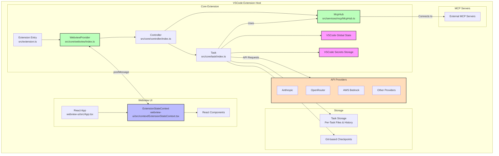

# Project Overview

## Architecture Overview

Cline is a VSCode extension that provides AI assistance through a combination of a core extension backend and a React-based webview frontend. The extension is built with TypeScript and follows a modular architecture pattern.

## Core Extension Architecture

The core extension follows a clear hierarchical structure:

1. **WebviewProvider** (src/core/webview/index.ts): Manages the webview lifecycle and communication.
2. **Controller** (src/core/controller/index.ts): Handles webview messages and task management.
3. **Task** (src/core/task/index.ts): Executes API requests and tool operations.

This architecture provides clear separation of concerns:

-   WebviewProvider focuses on VSCode webview integration.
-   Controller manages state and coordinates tasks.
-   Task handles the execution of AI requests and tool operations.

## Webview UI Architecture

The webview UI is a React-based application that provides the user interface for Cline. It includes:

1. **React App** (webview-ui/src/App.tsx): The main entry point for the React application.
2. **ExtensionStateContext** (webview-ui/src/context/ExtensionStateContext.tsx): Manages the state of the extension and provides it to React components through a context provider pattern.
3. **React Components**: Various components that make up the user interface.

## Storage System

Cline uses a storage system to manage task history, conversation data, and other persistent information:

1. **Task Storage (Per-Task Files & History)**: Stores individual tasks and their associated data.
2. **Checkpoint System (Git-based Checkpoints)**: Uses Git to create checkpoints of the project state, allowing for easy restoration and comparison.

## API Providers

Cline supports multiple AI providers through a modular API provider system:

1. **Anthropic**: Direct integration with Claude models.
2. **OpenRouter**: Meta-provider supporting multiple model providers.
3. **AWS Bedrock**: Integration with Amazon's AI services.
4. **Other Providers**: Additional AI providers can be integrated following the same pattern.

## MCP Servers

Cline integrates with external Model Context Protocol (MCP) servers to extend its capabilities:

1. **External MCP Servers**: Connects to and interacts with external MCP servers for additional tools and resources.
